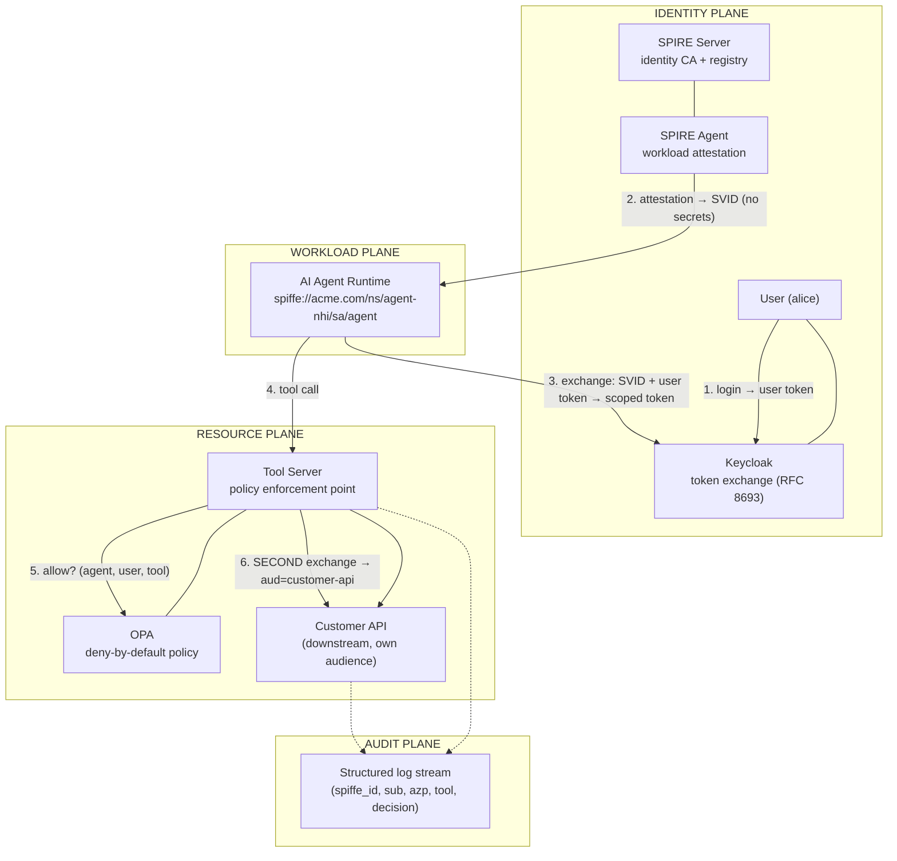

# Enterprise NHI for AI Agents

**A working reference architecture for Non-Human Identity: an AI agent that
proves what it is — cryptographically — instead of carrying API keys.**

Most agent deployments today hand the agent a static API key and hope. This
demo shows the enterprise alternative on a local Kubernetes cluster:

- the agent gets a **cryptographic workload identity** (SPIFFE ID, issued by
  SPIRE after Kubernetes attests the pod) — it never touches a secret
- it acts **on behalf of a user** via OAuth 2.0 **token exchange** (RFC 8693,
  Keycloak Standard Token Exchange V2) — every token carries the delegation
  binding `sub` (the user) + `azp` (the workload the token was issued to)
- every tool call is **authorized by policy** (OPA, deny-by-default)
- tokens are **never forwarded** — each hop exchanges for its own
  audience-scoped token
- every hop writes an **audit record** keyed by the full identity chain



## See it in 3D

Open **`docs/visualization/index.html`** in any browser (double-click it — no
server needed): orbit the planes, press **▶ Play trust flow**, click any
component for its function, and flip on **⚠ Attack mode** to watch three
attacks get blocked. Built for presenting.

## Run it

Prereqs: Docker, `kind` (`brew install kind`), `kubectl`. For the default LLM
path, Ollama must be installed **and running so the cluster can reach it**:

```sh
brew install ollama && ollama pull llama3.2:3b
OLLAMA_HOST=0.0.0.0:11434 ollama serve   # leave running in another terminal
```

(`0.0.0.0` matters: the agent pod calls it at `host.docker.internal:11434`. If
Ollama isn't running, the agent logs `llm.fallback` and uses a deterministic
default tool — the identity/policy flow is unaffected.)

```sh
./scripts/setup.sh          # ~5 min: cluster, SPIRE, Keycloak, OPA, apps
./scripts/demo.sh           # the happy path, paced for presenting
./scripts/attack-tests.sh   # three attacks, three failures
./scripts/teardown.sh       # nuke the cluster
```

## Docs

| Doc | Read it if you want… |
|---|---|
| [docs/glossary.md](docs/glossary.md) | the vocabulary (NHI, SVID, `azp`, …) in plain language |
| [docs/architecture.md](docs/architecture.md) | every component, what it proves, the 6-hop flow |
| [docs/threat-model.md](docs/threat-model.md) | the attacks this stops — and the one static secret it doesn't |
| [docs/presenting-the-demo.md](docs/presenting-the-demo.md) | a 10-minute talk track for showing this to people |
| [docs/runbook.md](docs/runbook.md) | setup details, troubleshooting, browser access |
| [docs/mcp-migration.md](docs/mcp-migration.md) | how the HTTP tool API becomes a real MCP server |
| [HANDOFF.md](HANDOFF.md) | the 15-minute review path through this repo |

## The one-sentence version

> OAuth answers *"is this actor allowed?"* — SPIFFE answers *"what IS this
> actor?"* — and an agent you can't identify is an agent you can't govern.

_This is a teaching/demo artifact: disposable kind cluster, demo passwords,
HTTP inside the cluster. Each simplification is called out where it lives._
